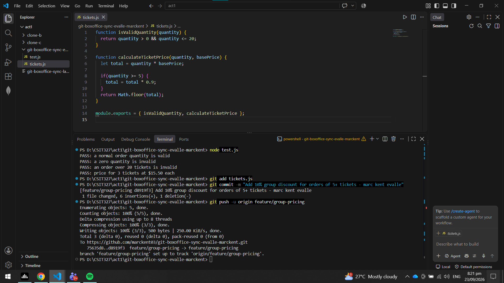
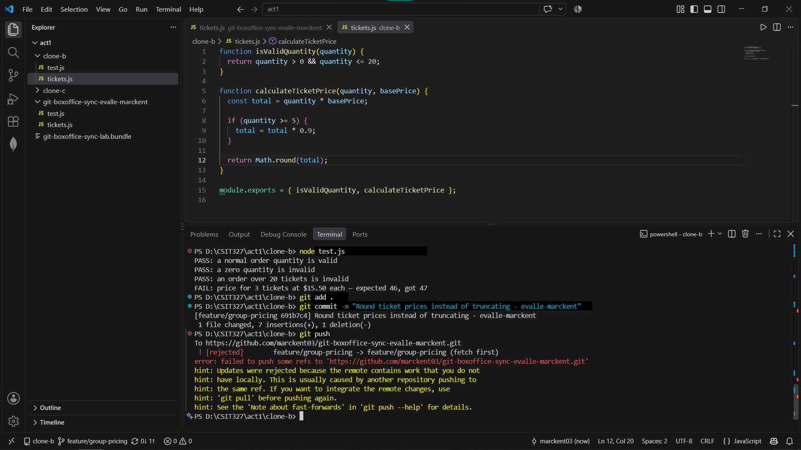
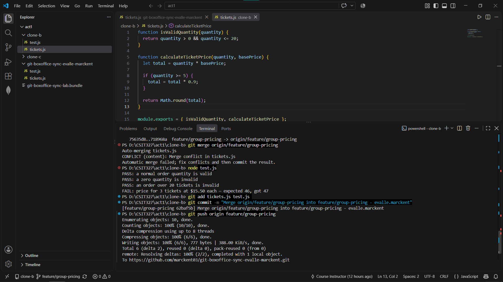
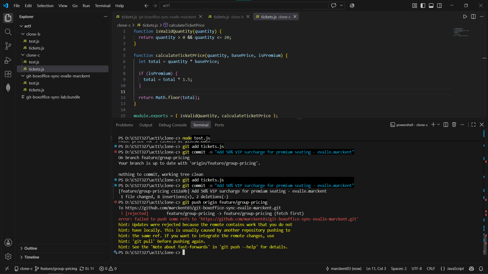
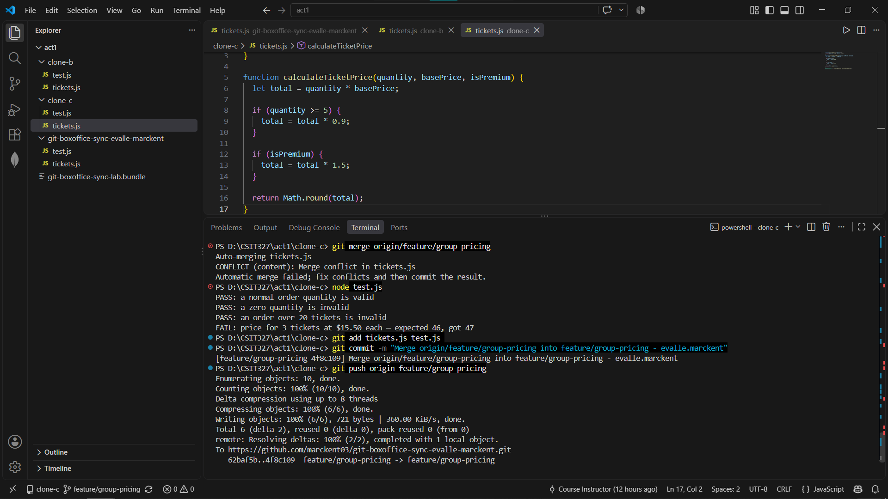
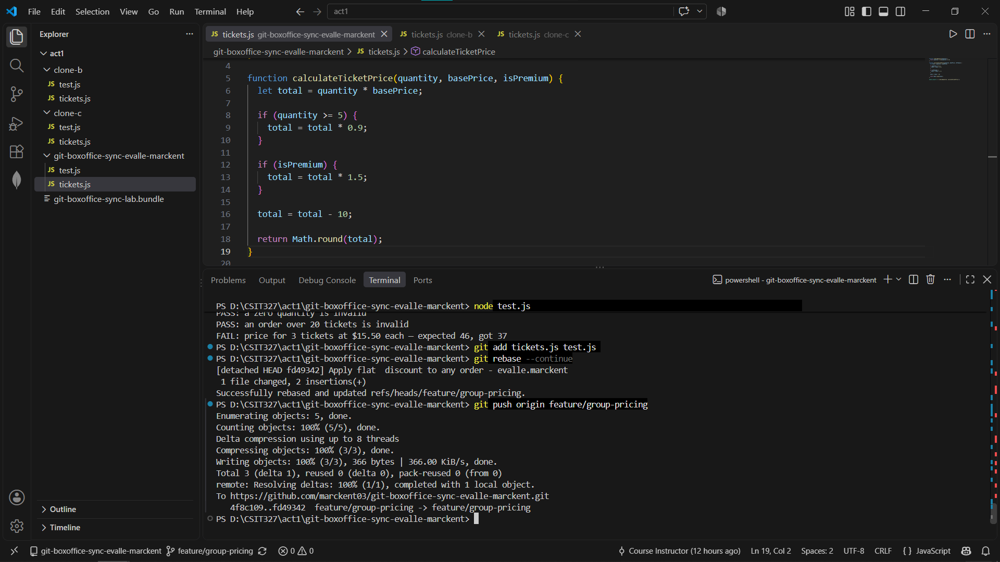
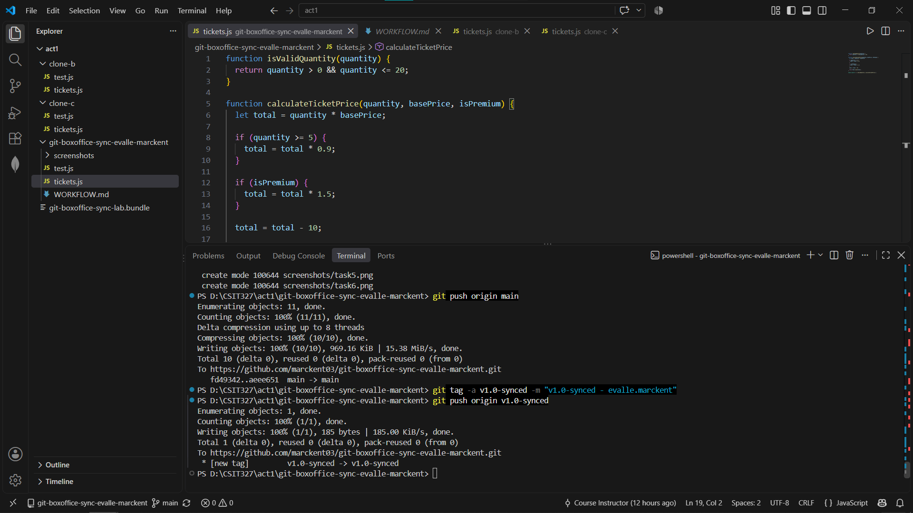

# WORKFLOW.md

## Task 1: Group Discount

## Task 2: Rejected Push

## Task 3: Merge Conflict

## Task 4: VIP Surcharge Rejected Push

## Task 5: Three-way Merge

## Task 6: Rebase Conflict

## Task 7: Final Merge and Tag

## Answers to Questions
**Compare Task 3's two-way conflict to Task 5's three-way conflict— what got harder with a third line of work?**
Task 3 had two lines of work: group discount vs rounding. Task 5 had three: group discount, rounding, and VIP surcharge. The three-way conflict was harder because you had to preserve three intentions at once, understand how they interact, and update tests that now depend on all three behaviors. There is more chance of accidentally dropping one contributor’s change.

**Why did Task 6's flat $10 discount change the expected result of tests unrelated to your change (the group-discount and VIP tests). Why, and what does that tell you about "isolated" changes in shared code?**
Because all those tests call the same shared calculateTicketPrice function. Even though your change was “just a flat discount,” it changes the final return value. So tests for group discount and VIP surcharge also see a different number. This shows that code is not isolated just because your change is in one function, if the function is shared, every caller and every test can be affected.

**If this were a real team of three, what one process change would have prevented all three rejected pushes?**
The best single process change: everyone fetches/rebase or pulls the latest shared branch before starting and before pushing, or better, use separate feature branches and merge through pull requests instead of all pushing directly to feature/group-pricing. That would have prevented all three rejected pushes.